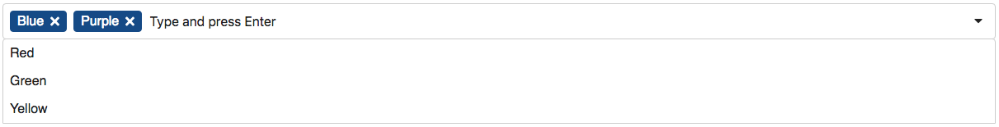

# Raven Multiselect for Angular 6+

An Angular component for selecting multiple values from a list.



## Features

* Add values not present in the list
* Filter the list as you type
* Keyboard/touch accessible
* Compatible with template driven and reactive forms
* Easily styled with CSS variables

## Installation

Install into your Angular project using NPM.

`npm install raven-multiselect --save`

Import the **MultiselectModule** into your module, and import the **FormsModule** or **ReactiveFormsModule** depending on which you'll be using (**FormsModule** is used for these examples).

```ts
import { MultiselectModule } from 'raven-multiselect';
import { FormsModule } from '@angular/forms';
// ...

@NgModule({
  imports: [
    MultiselectModule,
    FormsModule
    // ...
  ],
  // ...
})
export class AppModule { }
```

## Usage

Add a &lt;raven-multiselect&gt; element to your template, and use &lt;option&gt; tags to create text/values for the multiselect list.


```ts
import { Component } from '@angular/core';

@Component({
  selector: 'app-root',
  template: `
    <raven-multiselect [(ngModel)]="selectedValues"
                       [enableCustomValues]="true"
                       placeholder="Type or select a color">
      <option value="red">Red</option>
      <option value="green">Green</option>
      <option value="blue">Blue</option>
      <option value="yellow">Yellow</option>
    </raven-multiselect>`,
  styles: []
})
export class AppComponent {
  selectedValues = 'red,blue';
}
```

### Options
| Option             | Type          | Description                            | Default Value       
| :----------------- | :------------ | :------------------------------------- | :-------------------
| enableCustomValues | boolean       | Allows user to type in a custom value. | false
| placeholder        | string        | Placeholder text for text box.         | Type and press Enter

### Styling

CSS variables are used for styling. Example:

```css
raven-multiselect {
  --rms-choice-color-text: #222;
  --rms-choice-color-bg: #eee;
}
```

#### Available CSS Variables

| Variable                       | Description
| :---------------------------   | :----------------------------------------
| --rms-control-height           | Height of the main box.
| --rms-control-space-multiplier | Affects the amount of padding applied.
| --rms-control-color-text       | Text color of the box.
| --rms-control-color-bg         | Background color of the box.
| --rms-control-color-border     | Border color of the box.
| --rms-control-border-radius    | Border radius for the box.
| --rms-choice-color-text        | Text color of selected values.
| --rms-choice-color-bg          | Background color of selected values.
| --rms-choice-color-border      | Border color of selected values.
| --rms-choice-border-radius     | Border radius for selected values.
| --rms-dropdown-color-text      | Text color of drop-down box.
| --rms-dropdown-color-bg        | Background color of drop-down box.
| --rms-dropdown-color-border    | Border color of drop-down box.
| --rms-dropdown-border-radius   | Border radius for drop-down box.
| --rms-dropdown-color-hover     | Background color of hover/focused items.

## Development

Clone this repository and run `npm install`. Then run `ng serve -o` to start a development server and to open a sample page in your browser.

## License

MIT license.
